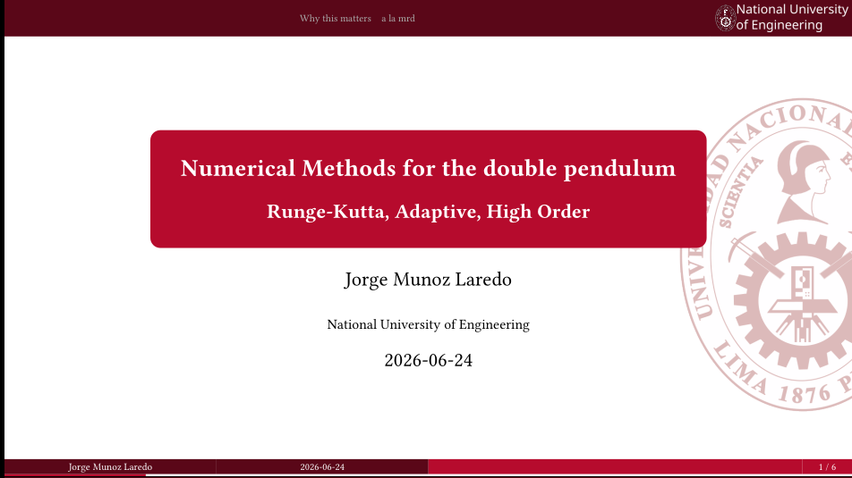

<p align="center">
    
</p>

# Touying Slide Theme for National University of Engineering

[](LICENSE)

A slide theme for the National University of Engineering (UNI) based on the [Touying](https://github.com/touying-typ/touying) presentation framework.

Adapted from the [Touying slide theme for ECNU](https://github.com/ccyoung3/touying-simpl-ecnu), which was modified from [CAU](https://github.com/maxchang3/touying-simpl-cau/) and [originally created for Beihang University](https://github.com/Coekjan/touying-buaa).

## Usage

### Import the theme in existing projects

```typst
#import "@preview/touying:0.6.1": *
#import "@local/touying-simpl-uni:1.0.0": *

#show: uni-theme.with(
    config-info(
        title: [Touying for UNI: Customize Your Slide Title Here],
        subtitle: [Customize Your Slide Subtitle Here],
        author: [Authors],
        date: datetime.today(),
        institution: [National University of Engineering],
    ),
    // use-background: false, // Uncomment to disable background image
)

#title-slide() // Create a title slide

#outline-slide() // Create an outline slide

// Add your content here
```

### Create a new project with `typst init`

Quickly scaffold a new presentation with:

```console
$ typst init @preview/touying-simpl-uni
Successfully created new project from @preview/touying-simpl-uni:<latest>
To start writing, run:
> cd touying-simpl-uni
> typst watch main.typ
```

## How to use it like local package

You have to symlink this package to your local Typst packages directory.

```bash
mkdir -p ~/.local/share/typst/packages/local/touying-simpl-uni
ln -s ./touying-simpl-uni/* ~/.local/share/typst/packages/local/touying-simpl-uni/*
```

And use it in your Typst project:

```typst
#import "@local/touying-simpl-uni:1.0.0" 
```

## Examples


See [examples](examples) for more details.

Compile the examples yourself:

```console
$ typst compile ./examples/main.typ --root .
```

The compiled presentation will be available at `./examples/main.pdf`.

## Development

This package is maintained using:

- [Typship](https://github.com/sjfhsjfh/typship) - for publishing to the Typst package registry.
- [Typst Upgrade](https://github.com/Coekjan/typst-upgrade) - for upgrading Typst packages.

## License

Licensed under the [MIT License](LICENSE).
